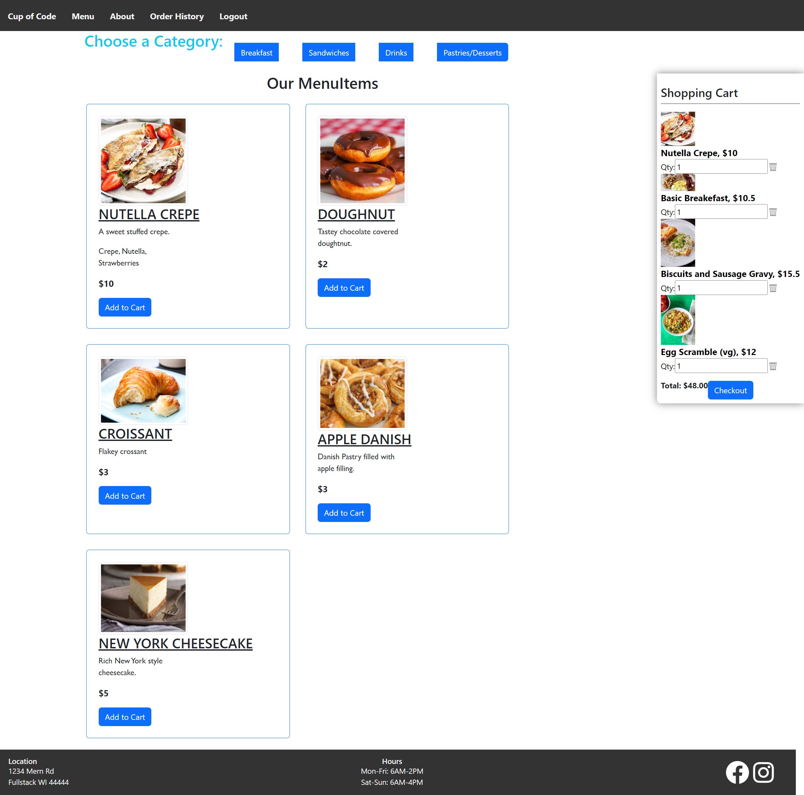
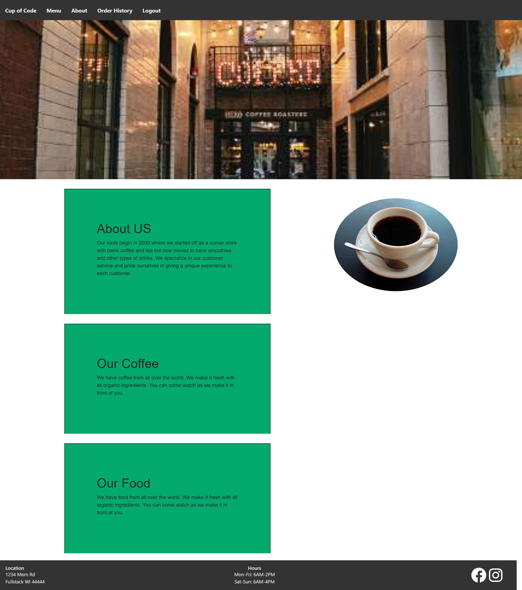

# Cup-of-Code

## Description

This is a Coffee Shop website that is used to create orders from a menu. The user must be logged in to create a order. We built this because it demonstrates the use of MERN Development with MongoDB for database, Express for back end and React for the front end using node js. We had problems with the cart and through troubleshooting we were able to resolve issues. We learned how to create a full functioning MERN website.  
[Heroku Deployment](https://polar-headland-37122.herokuapp.com/)  
  
  


## Table of Contents


- [Installation](#installation)
- [Usage](#usage)
- [Credits](#credits)
- [License](#license)
- [Badges](#badges)

## Installation

```git
git clone https://github.com/T0rgy/mern-group-project-3.git
```

```nodejs
npm install
```

```nodejs
npm run seed
```

```nodejs
npm start
```

go to
```url
http://localhost:3000
```
or 
```url

```

## Usage


## Credits

Jacob Torgeson<br>
Michael Samm<br>
Sajid Jaber<br>


## License

Permission is hereby granted, free of charge, to any person obtaining a copy
of this software and associated documentation files (the "Software"), to deal
in the Software without restriction, including without limitation the rights
to use, copy, modify, merge, publish, distribute, sublicense, and/or sell
copies of the Software, and to permit persons to whom the Software is
furnished to do so, subject to the following conditions:

The above copyright notice and this permission notice shall be included in all
copies or substantial portions of the Software.

THE SOFTWARE IS PROVIDED "AS IS", WITHOUT WARRANTY OF ANY KIND, EXPRESS OR
IMPLIED, INCLUDING BUT NOT LIMITED TO THE WARRANTIES OF MERCHANTABILITY,
FITNESS FOR A PARTICULAR PURPOSE AND NONINFRINGEMENT. IN NO EVENT SHALL THE
AUTHORS OR COPYRIGHT HOLDERS BE LIABLE FOR ANY CLAIM, DAMAGES OR OTHER
LIABILITY, WHETHER IN AN ACTION OF CONTRACT, TORT OR OTHERWISE, ARISING FROM,
OUT OF OR IN CONNECTION WITH THE SOFTWARE OR THE USE OR OTHER DEALINGS IN THE
SOFTWARE.

## Badges

